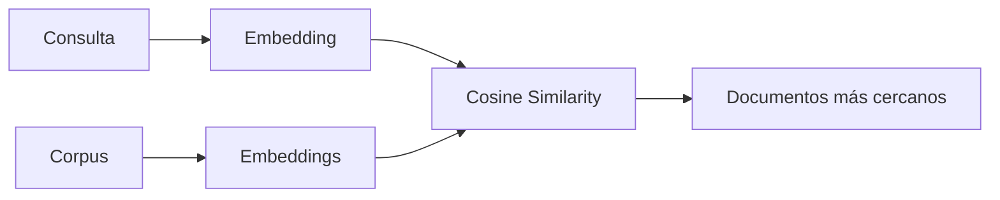
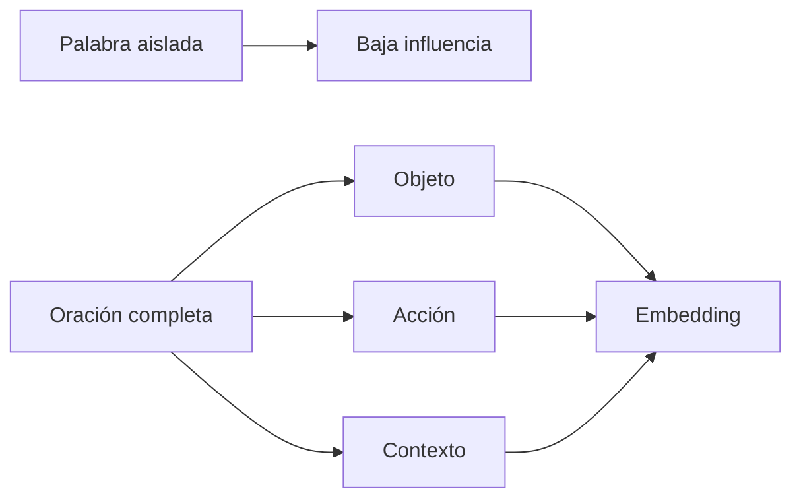
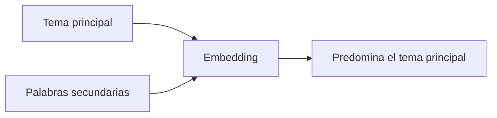
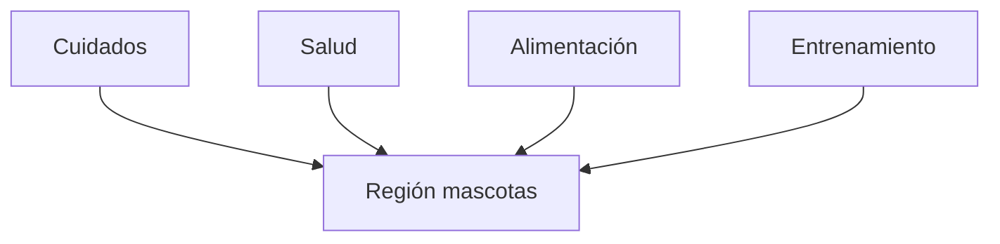
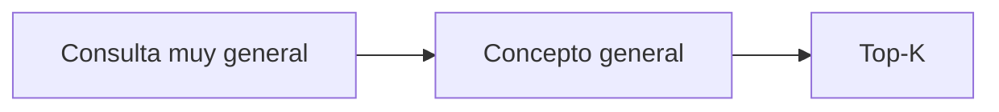
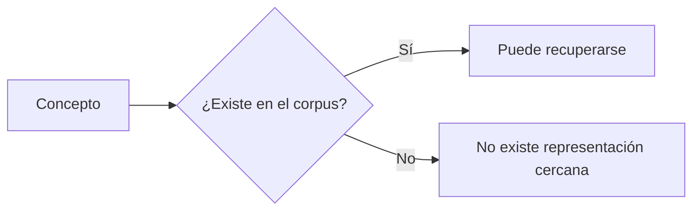
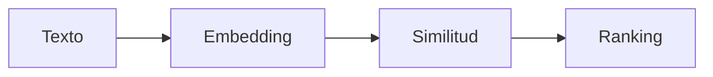

# Observaciones sobre el comportamiento del modelo

Documento parcial del laboratorio de búsqueda semántica. Índice completo en el [README](../README.md).

Observaciones obtenidas con `sentence-transformers/paraphrase-multilingual-MiniLM-L12-v2` sobre el corpus de mascotas. Todas las cifras salen de las corridas guardadas en [`logs/`](../logs) y se pueden reproducir con los modos de `main.py`.

## Flujo general

El modelo no aprende del corpus. El corpus se vectoriza una vez y cada consulta se compara contra esos embeddings mediante similitud del coseno. Como la similitud del coseno divide entre las magnitudes, lo que se compara es la dirección del vector, no su tamaño: por eso una consulta corta puede recuperar una oración larga del mismo tema.

## La comparación es semántica

El modelo compara el significado general de las oraciones, no únicamente las palabras que contienen.

El caso más limpio es la consulta de control, elegida a propósito para no compartir **ninguna** palabra con la oración que debe recuperar:

| Consulta | Documento recuperado | Semántico | Léxico |
| --- | --- | --- | --- |
| ¿cuánto tiempo pasan dormidos los felinos? | Los gatos duermen entre catorce y dieciséis horas al día. | 0.7932 | sin resultados |

`felinos` contra `gatos` y `dormidos` contra `duermen`: cero coincidencia de tokens, y aun así es el top-1 con el segundo puntaje más alto de toda la corrida. Esa consulta es la prueba de que se está midiendo semántica y no coincidencia literal disfrazada.

## Predomina el contexto completo

Una palabra ambigua por sí sola rara vez modifica el resultado. El embedding representa la oración completa, así que el contexto general pesa más que una palabra individual.

La contracara es que **una consulta de una sola palabra casi no tiene contexto que promediar**, y ahí el modelo se delata. Consultas de un solo término contra el corpus (`python main.py palabras`):

| Consulta | Top-1 recuperado | Similitud | ¿Correcto? |
| --- | --- | --- | --- |
| gato | Un gato adulto suele ser más independiente... | 0.6253 | Sí |
| filtro | Los peces tropicales requieren un filtro limpio... | 0.3352 | Sí |
| pastillas | Los mininos marcan su territorio frotando la cabeza... | 0.3330 | No |
| caja | Los mininos marcan su territorio frotando la cabeza... | 0.2439 | No |
| correa | Los mininos marcan su territorio frotando la cabeza... | 0.2330 | No |

Dos lecturas de esta tabla:

- El puntaje sube cuando hay coincidencia léxica de superficie (`gato` aparece literalmente en varias oraciones) y se hunde cuando no la hay. Buena parte de la decisión del modelo en consultas cortas viene del solapamiento de tokens, no de la semántica.
- Los tres fallos devuelven **la misma oración**, la de los mininos. Sin señal aprovechable, el modelo no se abstiene: entrega el vecino menos malo del espacio con confianza aparente. Los tres caen en la franja 0.23–0.34.

## El tema principal domina la representación

En oraciones que mezclan vocabulario de distintos dominios, el modelo tiende a conservar el tema principal.

Este comportamiento tiene un límite medible, y es el que explota el ejercicio adversarial. Cuando las palabras del otro dominio son varias y están alineadas entre sí, sí desplazan el embedding. Contra el corpus proxy de mecánica, la oración *"Cambié la caja del gato por una más grande y ahora entra sin problema"* — cien por ciento válida como oración de mascotas — gana el top-1 en la consulta *"¿cuándo cambiar la caja?"* con 0.5426.

No es que baste una palabra: es que la densidad de señal alineada vence al tema principal.

## El modelo organiza regiones semánticas

Las oraciones de un mismo tema se agrupan en regiones cercanas del espacio vectorial.

Por eso una consulta específica puede recuperar documentos del mismo dominio aunque no respondan a la intención buscada.

## Generalización

Cuando la consulta es poco específica, el modelo la aproxima al concepto general más cercano del dominio.

Un caso concreto: *"¿cada cuánto se le cambia la correa?"* devuelve *"La desparasitación con pastillas debe repetirse cada tres o cuatro meses"* con 0.4338. El modelo no engancha el sustantivo `correa`, engancha la **estructura** de la consulta: "cada cuánto se repite un mantenimiento periódico". El patrón sintáctico pesa más que el objeto.

Ese mismo efecto se observó del lado del ataque: la oración de las pastillas del perro entra mejor en la consulta *"¿cada cuánto se cambia la correa?"* (0.4792) que en cualquier consulta de frenos.

## Dependencia del corpus

El modelo únicamente puede recuperar conceptos presentes en el corpus.

Esto resultó tener una consecuencia defensiva directa. En la versión original del corpus, ninguna oración contenía `correa`, `pastillas` ni `filtro`. Ante un ataque por esas palabras no había documento propio con el cual competir, y el intruso ganaba el top-1 por defecto. Al insertar esas tres palabras en oraciones que ya existían — sin agregar oraciones, el corpus sigue en 25 — la consulta de `filtro` pasó a recuperar la oración correcta y la de `correa` dejó de aceptarse a ciegas.

## El embedding no razona

El modelo calcula cercanía entre vectores. No hace razonamiento lógico ni verifica hechos.

Su función es recuperar documentos similares, no interpretar conocimiento. Por eso el top-k es la base de RAG: se le entregan varios candidatos a un modelo generativo para que sea él quien contraste y decida.

## Comparación con el baseline léxico

El detalle está en [comparacion-cualitativa.md](comparacion-cualitativa.md). Lo relevante para caracterizar al modelo:

- En las 6 consultas de prueba, ambos métodos coinciden en el top-1 solo 3 veces. Las diferencias no son ruido: aparecen justo donde la consulta parafrasea.
- El léxico no devuelve nada en 1 de 6 consultas. El semántico siempre devuelve algo, y esa es a la vez su ventaja y su riesgo.
- El léxico nunca produce un falso positivo silencioso: si no hay coincidencia, no hay resultado. El semántico sí, y por eso necesita umbral.

## Hallazgos principales

### Fortalezas

- Recupera por significado: acierta con paráfrasis sin coincidencia léxica alguna (0.7932 en la consulta de control).
- Tolera sinónimos de registro distinto (`felino` / `gato`, `can` / `perro`).
- Agrupa documentos del mismo tema en regiones cercanas.
- Siempre devuelve un ranking, lo que lo hace usable como recuperador para RAG.

### Limitaciones

- En consultas cortas, buena parte del puntaje viene del solapamiento léxico de superficie. Es un modelo de 384 dimensiones entrenado para paráfrasis: la desambiguación contextual tiene un techo, y ese techo es explotable.
- No se abstiene. Sin señal útil devuelve el vecino menos malo con un puntaje que parece razonable. Los falsos positivos se concentran en la franja 0.23–0.40, que es lo que justifica el umbral de 0.35.
- Engancha la estructura de la consulta tanto como su contenido: "cada cuánto se cambia X" domina sobre qué sea X.
- Depende completamente del corpus. Un concepto ausente no tiene representación cercana, y esa ausencia es una puerta de entrada para un ataque.
- La estabilidad que se observa con un corpus de un solo dominio **no es robustez del modelo**. El top-k devuelve mascotas porque no hay otra cosa que devolver. En cuanto se inyectan documentos de otro dominio, tres de doce consultas pasan a tener un intruso en el top-1. Esa propiedad se cae exactamente cuando hace falta.
