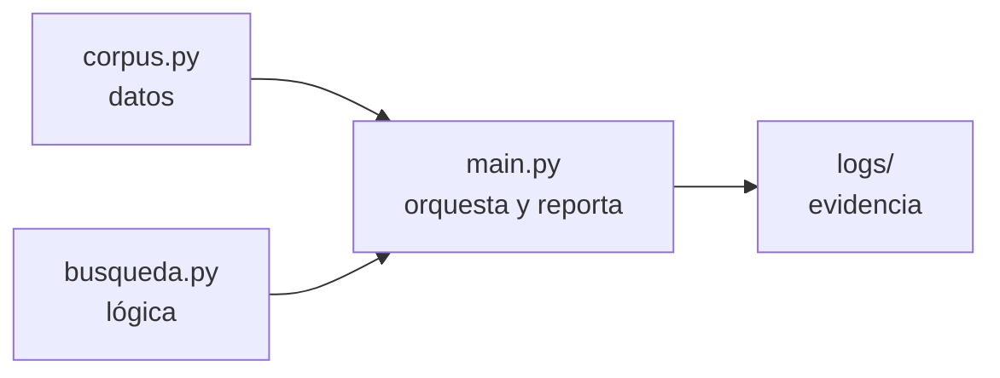
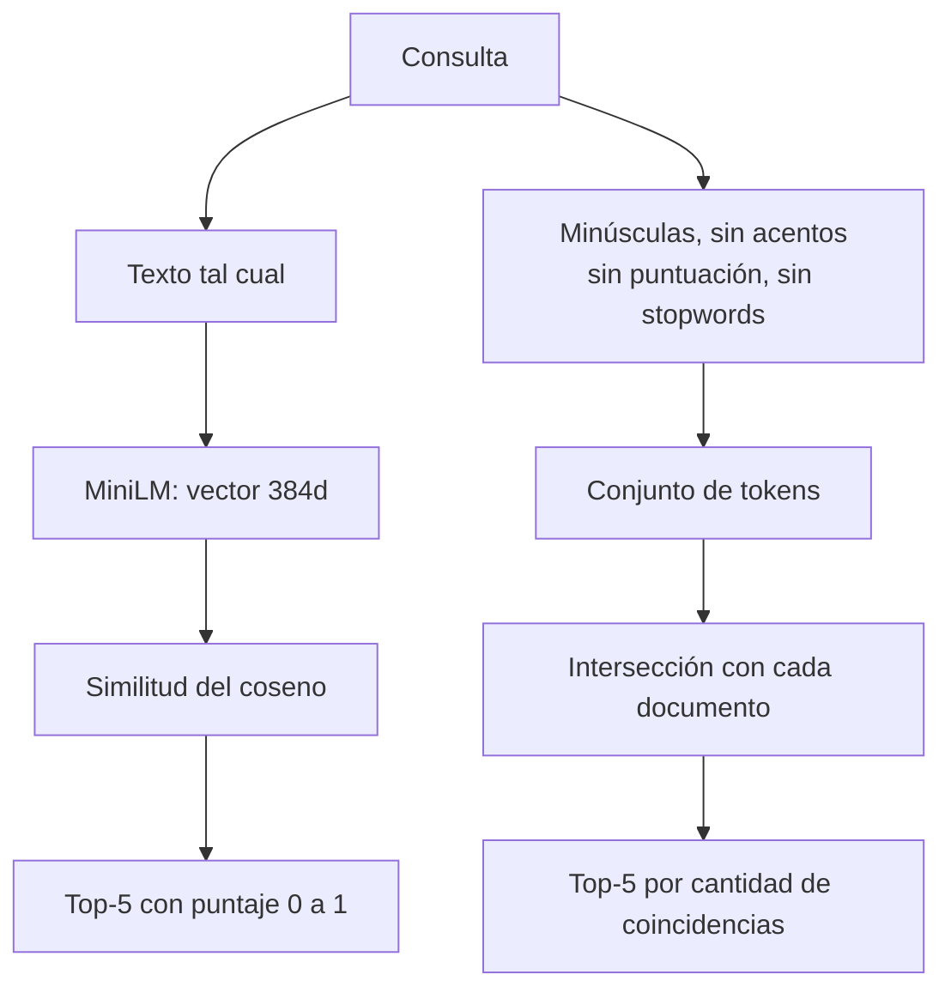
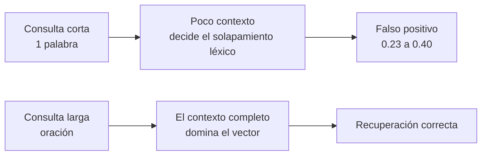
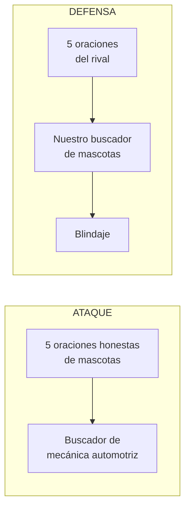
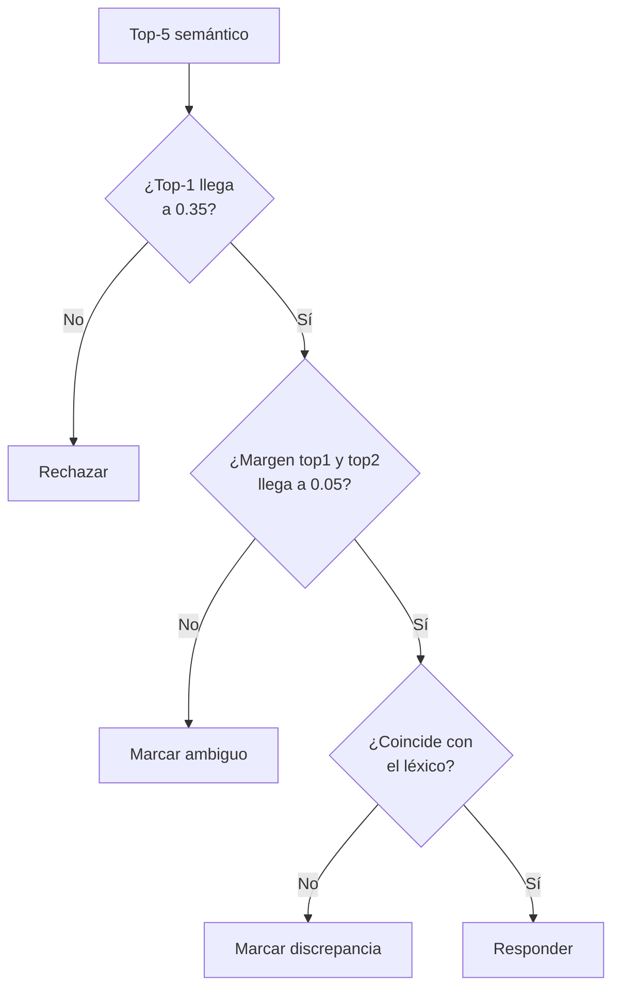

# Entrega: búsqueda semántica sobre corpus de mascotas

Búsqueda semántica con embeddings locales contra un baseline léxico por palabras clave. Tema propio: **mascotas** (25 oraciones). El dominio de **mecánica automotriz** aparece solo como objetivo del ejercicio adversarial, nunca como corpus propio.

Modelo: `paraphrase-multilingual-MiniLM-L12-v2`, 384 dimensiones, local.

## Instalación y uso

```bash
pip install sentence-transformers numpy scikit-learn
python main.py <modo>
```

| Modo | Qué hace | Corpus indexado |
| --- | --- | --- |
| `prueba` | 6 consultas del enunciado por ambos buscadores | 25 propias |
| `ambiguas` | 6 consultas con palabras puente, con blindaje | 25 propias |
| `palabras` | Consultas de una sola palabra (diagnóstico) | 25 propias |
| `ataque` | Nuestras 5 oraciones contra un proxy de mecánica | 15 mecánica + 5 nuestras |
| `defensa` | Oraciones del rival inyectadas como documentos | 25 propias + 5 intrusas |
| `consulta` | Oraciones del rival usadas como consulta | 25 propias, limpio |

## Arquitectura: tres archivos



| Archivo | Contiene |
| --- | --- |
| `corpus.py` | Corpus de 25 oraciones, consultas, oraciones de ataque y fixtures |
| `busqueda.py` | Los dos buscadores, caché de embeddings y blindaje |
| `main.py` | Los 6 modos y la impresión de resultados |

## Los dos buscadores



| | Semántico | Léxico |
| --- | --- | --- |
| Compara | Significado (dirección del vector) | Palabras exactas |
| Preprocesa | Nada, texto tal cual | Normaliza y quita stopwords |
| Si no encuentra | Devuelve el vecino menos malo | No devuelve nada |
| Falla | Silenciosamente, con puntaje alto | Visiblemente, sin resultados |

## Comparación: 3 de 6 consultas coinciden en el top-1

Los casos donde se separan son los informativos.

| Situación | Consulta | Resultado |
| --- | --- | --- |
| Semántico gana | ¿cuánto tiempo pasan dormidos los felinos? | 0.7932 contra *"Los gatos duermen..."*; el léxico **no recupera nada** (cero tokens en común) |
| Léxico gana | ¿cómo entrenar a un cachorro...? | El semántico devuelve las caminatas; el léxico apunta al entrenamiento |
| Ambos fallan | ¿cómo saber si mi mascota está enferma? | El léxico falla con puntaje 1, visible; el semántico con 0.6707, **disimulado** |

Conclusión: el léxico tiene precisión frágil y honestidad alta; el semántico, cobertura alta y honestidad baja. Por eso se cruzan en vez de elegir uno.

## Análisis del modelo



Consultas de una sola palabra contra el corpus:

| Consulta | Similitud | ¿Acierta? |
| --- | --- | --- |
| gato | 0.6253 | Sí, `gato` aparece literal en el corpus |
| filtro | 0.3352 | Sí |
| pastillas / caja / correa | 0.33 / 0.24 / 0.23 | No, las tres devuelven **la misma** oración irrelevante |

Hallazgos:

- El puntaje sube con la coincidencia léxica y se hunde sin ella. Un modelo de 384 dimensiones tiene un techo de desambiguación, y es explotable.
- **No se abstiene**: sin señal útil devuelve el vecino menos malo con puntaje que parece razonable. Los falsos positivos caen en 0.23–0.40, y de ahí sale el umbral de 0.35.
- Engancha la **estructura** tanto como el contenido: *"¿cada cuánto se le cambia la correa?"* devuelve la desparasitación, porque el patrón "cada cuánto se repite X" pesa más que el sustantivo.
- La estabilidad con un corpus de un solo dominio **no es robustez**: el top-k devuelve mascotas porque no hay otra cosa. Al inyectar documentos ajenos, 3 de 12 consultas pasan a tener intruso en el top-1.

## Ejercicio adversarial



Palabras puente: `gato`, `correa`, `caja`, `pastillas`, `filtro`. La trampa está en el vocabulario, no en hacer trampa: las 5 oraciones son válidas como oraciones de mascotas.

### Descubrimiento principal

Para no especular se construyó un corpus proxy de mecánica y se **midió** el ataque. La medición desmintió el análisis en papel: 2 de las 5 oraciones originales no entraban en ningún top-5.

- Acumular palabras puente **no sirve**: el embedding promedia la oración y una escena coherente de mascotas domina el vector.
- Lo que funciona es **imitar la estructura de la consulta objetivo** ("cada cuánto se cambia X").

Se rehicieron dos oraciones con ese criterio.

### Resultados

| Escenario | Resultado |
| --- | --- |
| Ataque, oraciones indexadas | Entran en el top-5 de **9 de 10** consultas mecánicas, 3 en primer lugar |
| Ataque, oraciones como consulta | **5 de 5** superan el umbral; 3 pasarían un blindaje completo |
| Defensa, intrusos indexados | 3 de 12 ganan el top-1; **0** se entregan tras el blindaje |
| Defensa, intrusos como consulta | **0 de 5** respondidas |

### Blindaje



Más el prefijo de dominio (`"sobre mascotas: "` antepuesto a la consulta), que recuperó el top-1 propio en los 3 casos donde un intruso lo había ganado.

El umbral solo no basta: la consulta *"El gato hidráulico soporta hasta dos toneladas"* alcanza **0.5796** contra el corpus de mascotas —el homónimo `gato` la arrastra a la caja de arena del felino— y la frena únicamente el cruce con el buscador léxico.

## Detalle

| Documento | Contenido |
| --- | --- |
| [comparacion-cualitativa.md](comparacion-cualitativa.md) | Semántico contra léxico, caso por caso |
| [analisis-modelo.md](analisis-modelo.md) | Comportamiento del modelo con evidencia |
| [analisis-adversarial.md](analisis-adversarial.md) | Selección medida de las 5 oraciones y blindaje |
| [instrucciones.md](instrucciones.md) | Enunciado y dónde se cumple cada requisito |
| [instalacion.md](instalacion.md) | Dependencias y regeneración de logs |
